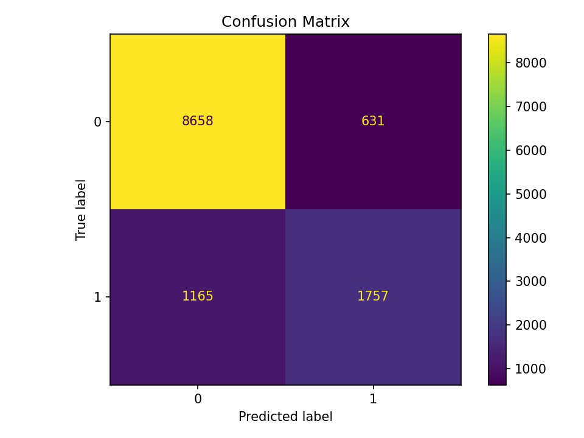

# Práctica 2 — Análisis del dataset Adult Income (Python)

**Integrantes**
- SEBASTIAN SERRENTINO MANGINO (Integrante 1)
- ALBERTO MOCHON (Integrante 2)

**Repositorio**: PENDIENTE

**Vídeo**: PENDIENTE

Fecha de generación: **2025-12-22**

## 1. Descripción del dataset
Trabajamos con el dataset **Adult Income** (UCI), cuyo objetivo es analizar qué variables socio-demográficas y laborales se asocian con la probabilidad de percibir ingresos **>50K**.

El dataset integrado contiene **48,842** registros. La variable objetivo es `income` (<=50K vs >50K).
Distribución de clases: `<=50K` = **37,155** (76.07%), `>50K` = **11,687** (23.93%).

Este dataset resulta especialmente adecuado para un análisis estadístico y de ciencia de datos porque combina **variables numéricas y categóricas**, presenta **valores faltantes semánticos** (p. ej. `?`) y contiene **valores extremos** en variables financieras (p. ej. `capital_gain`, `capital_loss`). Estas características permiten aplicar de forma natural técnicas de integración, limpieza, validación, análisis supervisado y no supervisado, además de contrastes de hipótesis.

**Estructura de variables (resumen):**
- **Numéricas**: `age`, `fnlwgt`, `education_num`, `capital_gain`, `capital_loss`, `hours_per_week`.
- **Categóricas**: `workclass`, `education`, `marital_status`, `occupation`, `relationship`, `race`, `sex`, `native_country`.
- **Objetivo**: `income`.

Dado el desbalance aproximado 3:1, además de la accuracy se reportan métricas por clase (precision/recall/F1) y AUC.

**Alcance del análisis**: el objetivo del trabajo es **descriptivo y predictivo**, no causal. Por tanto, las asociaciones observadas no deben interpretarse como relaciones causa–efecto.

**Uso del análisis no supervisado**: las técnicas no supervisadas se emplean con fines **exploratorios**, para identificar patrones y estructura potencial en los datos, sin asumir grupos “reales” o interpretables a priori.

**Fuente de datos (citación):**

- Becker, B. & Kohavi, R. (1996). *Adult* [Dataset]. UCI Machine Learning Repository. https://doi.org/10.24432/C5XW20

**Nota ética y de uso**: el dataset es de uso académico/público; el análisis se presenta con fines formativos. Se evita cualquier interpretación discriminatoria y no se realizan afirmaciones causales a partir de variables sensibles.

## 2. Integración y selección de los datos
Se integran los conjuntos train y test del Adult Income y se conservan las variables estándar del dominio (edad, educación, horas, capital_gain/capital_loss y categóricas de contexto).

**Resumen a simple vista (dataset integrado):**

**Variables numéricas — estadísticos básicos:**

| variable       |   count |      mean |       std |   min |    25% |    50% |    75% |            max |
|:---------------|--------:|----------:|----------:|------:|-------:|-------:|-------:|---------------:|
| age            |   48842 |     38.64 |     13.71 |    17 |     28 |     37 |     48 |    90          |
| fnlwgt         |   48842 | 189664    | 105604    | 12285 | 117550 | 178144 | 237642 |     1.4904e+06 |
| education_num  |   48842 |     10.08 |      2.57 |     1 |      9 |     10 |     12 |    16          |
| capital_gain   |   48842 |    785.87 |   3827.24 |     0 |      0 |      0 |      0 | 41310          |
| capital_loss   |   48842 |     86.14 |    394.38 |     0 |      0 |      0 |      0 |  2258          |
| hours_per_week |   48842 |     40.42 |     12.39 |     1 |     40 |     40 |     45 |    99          |

**Variables categóricas — resumen de categorías:**

| variable       |   n_categorías | categoría_más_frecuente   |   frecuencia |
|:---------------|---------------:|:--------------------------|-------------:|
| workclass      |              9 | Private                   |        33906 |
| education      |             16 | HS-grad                   |        15784 |
| marital_status |              7 | Married-civ-spouse        |        22379 |
| occupation     |             15 | Prof-specialty            |         6172 |
| relationship   |              6 | Husband                   |        19716 |
| race           |              5 | White                     |        41762 |

## 3. Limpieza de los datos
### 3.1 Faltantes y/o valores perdidos
Faltantes reales (NaN) antes de la limpieza (top 5 por columna):

| index         |   missing_count |   missing_pct |
|:--------------|----------------:|--------------:|
| age           |               0 |             0 |
| workclass     |               0 |             0 |
| fnlwgt        |               0 |             0 |
| education     |               0 |             0 |
| education_num |               0 |             0 |

Faltantes semánticos antes de la limpieza (incluye '?', vacío y equivalentes) (top 5):

| col            |   missing_count |   missing_pct |
|:---------------|----------------:|--------------:|
| occupation     |            2809 |       5.7512  |
| workclass      |            2799 |       5.73072 |
| native_country |             857 |       1.75464 |
| marital_status |               0 |       0       |
| education      |               0 |       0       |

**Observaciones:**
- La variable `occupation` concentra faltantes semánticos: **2809** registros (**5.75%** aprox.).
- La variable `workclass` concentra faltantes semánticos: **2799** registros (**5.73%** aprox.).
- La variable `native_country` concentra faltantes semánticos: **857** registros (**1.75%** aprox.).
- Este patrón sugiere que la ausencia de información no es uniforme y debe tratarse explícitamente para evitar sesgos.

## 4. Análisis y métricas
### 4.1 Supervisado y no supervisado
**Modelo supervisado (Regresión logística):** ROC-AUC = **0.9048**, Accuracy = **0.8529**.
Baseline (predecir siempre la clase mayoritaria): **0.7607**.
Para la clase `>50K` (positiva): Precision = **0.736**, Recall = **0.601**, F1 = **0.662**.
Interpretación: AUC alto indica buena discriminación; el recall moderado sugiere que el modelo pierde parte de los casos `>50K`, fenómeno consistente con el desbalance.
Matriz de confusión (test): TN=8658, FP=631, FN=1165, TP=1757.

**No supervisado (PCA+KMeans):** muestra n = **800**, k = **2**, silhouette = **0.4118**.
Interpretación: el clustering es exploratorio y depende del muestreo; no se extraen conclusiones predictivas fuertes sin validación de estabilidad.

### 4.2 Contraste de hipótesis
Contraste entre grupos de `income` sobre `hours_per_week` usando **Mann–Whitney U** (prueba no paramétrica, no requiere normalidad).
Medias: <=50K = **38.84**, >50K = **45.45**. Medianas: <=50K = **40.00**, >50K = **40.00**.
p-value = **< 1e-300**.
Como medida complementaria de magnitud, se estima mediante bootstrap el IC 95% para la **diferencia de medias** (>50K − <=50K): **[6.39, 6.86]**. El test Mann–Whitney U contrasta diferencias de ubicación/distribución, no específicamente de medias.
Interpretación: evidencia estadística fuerte de diferencias entre grupos; esto indica asociación, no causalidad.

## 5. Representación de resultados
### 5.1 Vista previa del dataset limpio
Muestra estratificada (3 filas de `<=50K` y 2 filas de `>50K`):

|   age | workclass        | education   |   hours_per_week |   capital_gain |   capital_loss | income   |
|------:|:-----------------|:------------|-----------------:|---------------:|---------------:|:---------|
|    39 | State-gov        | Bachelors   |               40 |           2174 |              0 | <=50K    |
|    50 | Self-emp-not-inc | Bachelors   |               13 |              0 |              0 | <=50K    |
|    38 | Private          | HS-grad     |               40 |              0 |              0 | <=50K    |
|    52 | Self-emp-not-inc | HS-grad     |               45 |              0 |              0 | >50K     |
|    31 | Private          | Masters     |               50 |          14084 |              0 | >50K     |

### 5.2 Métricas del modelo supervisado
Tabla resumida (precision/recall/F1/support):

|              |   precision |   recall |   f1-score |   support |
|:-------------|------------:|---------:|-----------:|----------:|
| 0            |    0.881401 | 0.93207  |   0.906028 |      9289 |
| 1            |    0.735762 | 0.6013   |   0.66177  |      2922 |
| macro avg    |    0.808581 | 0.766685 |   0.783899 |     12211 |
| weighted avg |    0.846551 | 0.852919 |   0.847579 |     12211 |

### 5.3 Gráficos generados
Se incluyen las figuras principales del análisis:

**ROC Curve**

**Matriz de confusión**

**Distribución de `hours_per_week` por clase**

**Proporción de `income` por nivel educativo (top 10)**

## 6. Conclusiones
A partir del proceso de limpieza y del análisis posterior, se obtienen las siguientes conclusiones principales:

- **Calidad del dato y limpieza**: la presencia de faltantes semánticos (`?`) se concentra en variables específicas (p. ej., `occupation`, `workclass`, `native_country`), por lo que tratarlas explícitamente mejora la consistencia del análisis y evita perder filas.
- **Valores extremos**: variables como `capital_gain` y `capital_loss` presentan colas largas; la winsorización permite estabilizar el análisis sin eliminar observaciones.

- **Modelo supervisado**: el clasificador logra un desempeño global sólido (ROC-AUC = **0.9048**, accuracy = **0.8529**), superando claramente el baseline de clase mayoritaria. Sin embargo, la recuperación de la clase `>50K` (recall = **0.601**) es moderada, coherente con el desbalance.
- **Contraste de hipótesis**: se observan diferencias consistentes entre grupos en `hours_per_week`. La diferencia de medias estimada es aproximadamente **6.61** horas/semana (IC 95% bootstrap: **[6.39, 6.86]**), con evidencia estadística muy fuerte.
- **Modelo no supervisado (exploratorio)**: con PCA + KMeans (k=2) se obtiene un silhouette ≈ **0.412**, lo que sugiere cierta separación estructural en los datos, sin implicar necesariamente grupos “reales” o interpretables.

**Limitaciones**: este análisis es observacional; los resultados describen asociaciones y capacidad predictiva, pero no permiten afirmar causalidad. El clustering se interpreta como exploratorio.

**Respuesta al problema planteado**: en términos descriptivos y predictivos, los resultados **sí permiten** abordar la pregunta propuesta: se observan asociaciones consistentes entre variables del perfil socio-laboral y el nivel de ingresos, y el modelo supervisado logra discriminar adecuadamente la clase `>50K` (AUC alto) respecto al baseline.

## 7. Código
El código fuente se encuentra en `src/`. Para ejecutar el pipeline: `python -m src.run_all`.

## 8. Vídeo
Enlace al vídeo (Google Drive UOC): PENDIENTE

## Tabla de contribuciones
| Contribuciones | Firma |
|---|---|
| Investigación previa | SS, AM |
| Redacción de las respuestas | SS, AM |
| Desarrollo del código | SS, AM |
| Participación en el vídeo | SS, AM |
